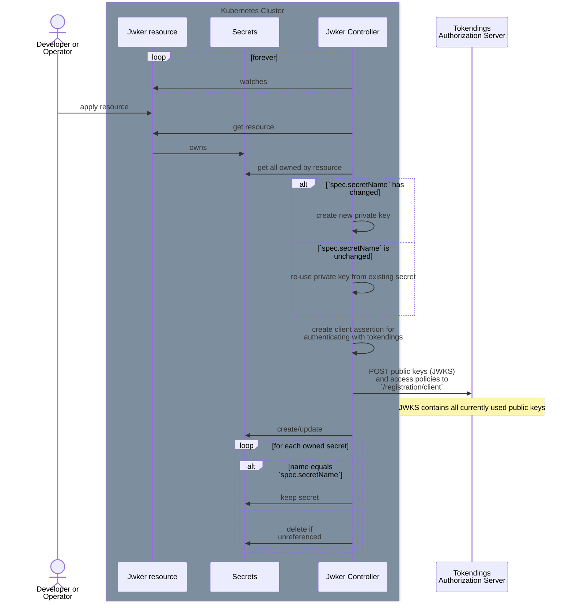

# Jwker

Jwker is a Kubernetes operator that manages OAuth2 client registrations for applications that use the [Tokendings](https://github.com/nais/tokendings) authorization server as part of the TokenX system.

It does this through the `Jwker` custom resource definition (CRD):

```yaml
apiVersion: nais.io/v1
kind: Jwker
metadata:
  name: my-app
  namespace: my-team
spec:
  accessPolicy:
    inbound:
      rules:
      - application: some-other-app
        namespace: some-team
        cluster: some-cluster
  secretName: jwker-my-app
```

For the full CRD specification, see the spec in [nais/liberator](https://github.com/nais/liberator):

- [nais/liberator/config/crd/nais.io_jwkers.yaml](https://github.com/nais/liberator/blob/main/config/crd/bases/nais.io_jwkers.yaml)

A `Jwker` resource contains:

- the access policies for the application
- the name of the Kubernetes secret that the application expects

The operator is responsible for managing the secret and reconciling the OAuth2 client with its policies and credentials with Tokendings.

The secret contains the following keys:

| Key                      | Description                                                                                    |
|--------------------------|------------------------------------------------------------------------------------------------|
| `TOKEN_X_CLIENT_ID`      | The application's client ID.                                                                   |
| `TOKEN_X_PRIVATE_JWK`    | The application's private JSON Web Key (JWK) for client authentication (RFC 7523, section 2.2) |
| `TOKEN_X_WELL_KNOWN_URL` | The URL pointing to the Tokendings' well-known metadata document.                              |
| `TOKEN_X_ISSUER`         | The `issuer` property from the metadata document.                                              |
| `TOKEN_X_JWKS_URI`       | The `jwks_uri` property from the metadata document.                                            |
| `TOKEN_X_TOKEN_ENDPOINT` | The `token_endpoint` property from the metadata document.                                      |

## Lifecycle



1. When a `Jwker` resource is applied to the cluster (either by a developer or another operator), the Jwker controller will reconcile it.
2. The controller reads the `Jwker` resource and retrieves all existing secrets owned by the resource.
3. The controller then checks if the `spec.secretName` has changed:
   1. If the secret name has changed, it creates a new private key for the application.
   2. If the secret name is unchanged, it reuses the private key from the existing secret.
4. The operator creates a client assertion for authenticating with Tokendings.
5. The application's public keys (JWKS) and access policies are registered with Tokendings via the `/registration/client` endpoint.
   1. The JWKS contains all currently used public keys to ensure key rotation works properly.
   2. Each application is registered with Tokendings using a unique identifier in the form of `clustername:namespace:application`
6. The operator creates or updates the Kubernetes secret with the specified `secretName`.
7. Finally, any unreferenced secrets are deleted to clean up resources.
   1. Secrets are considered referenced if mounted as files or environment variables in a pod.
   The pod must have a label `app=<name>` where `<name>` is equal to `.metadata.name` in the `Jwker` resource.

## Installation

```shell script
helm install jwker ./charts
```

## Usage

### Configuration

Jwker can be configured using either command-line flags or equivalent environment variables:

| Flag                          | Environment Variable   | Type   | Description                                                                |
|-------------------------------|------------------------|--------|----------------------------------------------------------------------------|
| `--cluster-name`              | `CLUSTER_NAME`         | string | The cluster name where this Jwker is deployed to.                          |
| `--client-id`                 | `JWKER_CLIENT_ID`      | string | Client ID for Jwker for identifying itself with Tokendings.                |
| `--client-jwk-json`           | `JWKER_PRIVATE_JWK`    | string | JSON string containing the private key in JWK format.                      |
| `--tokendings-base-url`       | `TOKENDINGS_URL`       | string | The base URL to Tokendings.                                                |
| `--tokendings-instances`      | `TOKENDINGS_INSTANCES` | string | Comma separated list of base URLs to multiple Tokendings instances.        |
| `--max-concurrent-reconciles` |                        | int    | Maximum number of concurrent reconciles for the controller. (default `20`) |
| `--metrics-addr`              |                        | string | The address the metric endpoint binds to. (default `:8181`)                |
| `--log-level`                 |                        | string | Log level. (default `info`)                                                |

## Development

Start a local Kubernetes cluster, e.g. using [kind](https://kind.sigs.k8s.io/), [minikube](https://minikube.sigs.k8s.io/), or similar.

Install the CRD if you haven't already:

```shell
make install-crd
```

Start up dependencies:

```shell
docker-compose up -d
```

Run the operator:

```shell
make local
```

Deploy a sample `Jwker`:

```shell
make sample
```
